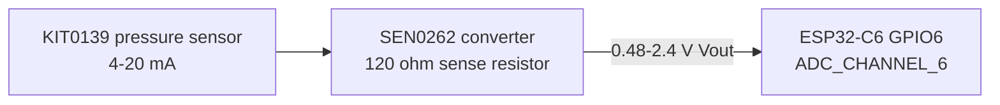

# Depth Sensor (ESP32‑C6 + Zigbee)

Water tank level sensor using an ESP32‑C6 and a Gravity Industrial Submersible Pressure Level Sensor (0–5 m) SKU: KIT0139, via the DFRobot Gravity Analog 4–20 mA to Voltage Converter (SEN0262).  
Publishes water depth (mm) and board temperature via Zigbee (Home Assistant through Zigbee2MQTT).
An onboard LED is exposed via Zigbee for basic status/identify.

## Features
- Depth reporting from 4–20 mA pressure sensor (Analog Output cluster presentValue in mm).
- Temperature reporting (Temperature Measurement cluster, 0.01°C resolution).
- Identify effect blinks the onboard LED for visual feedback.

## Hardware
- MCU: ESP32‑C6
- Level sensor: Gravity Industrial Submersible Pressure Level Sensor 0–5 m (KIT0139)
- Converter: DFRobot Gravity Analog Current to Voltage Converter (SEN0262, 4–20 mA → 0.48–2.4 V across 120 Ω)
- Onboard LED: single LED (mono) or discrete RGB depending on board version
- Temperature sensor: on‑board sensor (software driver included)

### Wiring
- Power the KIT0139 per its datasheet and connect its 4–20 mA output to the SEN0262 input.
- SEN0262 Vout → ESP32‑C6 GPIO6 (`ADC_CHANNEL_6` / ADC1 channel 6).
- SEN0262 GND → ESP32‑C6 GND.
- SEN0262 VCC per your board (typically 5V); ensure common ground with the ESP32‑C6.
- Important: The KIT0139 has a vented cable; keep the vent tube dry and open to atmosphere.



Notes:
- This project reads the ADC voltage, converts to current using the 120 Ω sense resistor, then maps 4–20 mA to 0–5000 mm depth.
- Depth is clamped and reported as 0–5000 millimeters (mm) to Zigbee.

## Firmware behavior
- ADC oneshot is configured for ADC1 channel 6, 12 dB attenuation, and 12-bit reads.
- ADC calibration is used when ESP-IDF provides it; otherwise firmware falls back to a 3300 mV full-scale approximation.
- Each depth update reads 8 ADC samples, drops the minimum and maximum, converts the trimmed mean to depth in mm, and rounds it.
- Depth is sampled once per second, averaged over the last 20 rounded depth readings, and published to the Analog Output cluster.
- Temperature is sampled once per second and reported in 0.01°C units through the Temperature Measurement cluster.
- The Identify command toggles the onboard LED once per second for visual location feedback.

## Zigbee
- Endpoint: 1
- Manufacturer/model: `Acheta` / `Depth.Sensor`
- Server clusters: Basic, Identify, Analog Output, Temperature Measurement, On/Off, Color Control, Scenes, Level, Groups
- Client clusters: Identify
- Analog Output `presentValue`: depth in mm as a floating-point value.
- Temperature Measurement value: board temperature in 0.01°C units.
- Reporting:
  - Analog Output `presentValue`: periodic 1–10 s, delta disabled.
  - Temperature Measurement: periodic 30–300 s or >=0.5°C change.

## ESP‑IDF Setup

Prerequisites:
- ESP‑IDF 6.0.x installed with required tools; verified with IDF 6.0.2.

Build-only verification used by CI:

```sh
. /path/to/esp-idf/export.sh
./scripts/verify-build.sh
```

The script runs `idf.py -B "${BUILD_DIR:-build}" build`. Set `BUILD_DIR=build-ci` to use a separate local build directory. GitHub Actions runs the same build gate on pushes and pull requests using the ESP-IDF 6.0.2 container.

Manual build, flash, and monitor:

```sh
. /path/to/esp-idf/export.sh
idf.py set-target esp32c6
idf.py build
idf.py -p /dev/ttyUSB0 flash
idf.py -p /dev/ttyUSB0 monitor
```

Hardware validation:

```sh
idf.py -p /dev/ttyUSB0 flash monitor
```

Adjust the serial device as needed, then verify depth readings, temperature reports, Zigbee join behavior, and LED attribute handling in the monitor logs. Use `Ctrl+]` to exit the IDF monitor.
